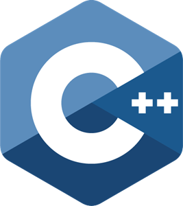
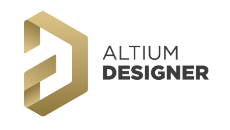
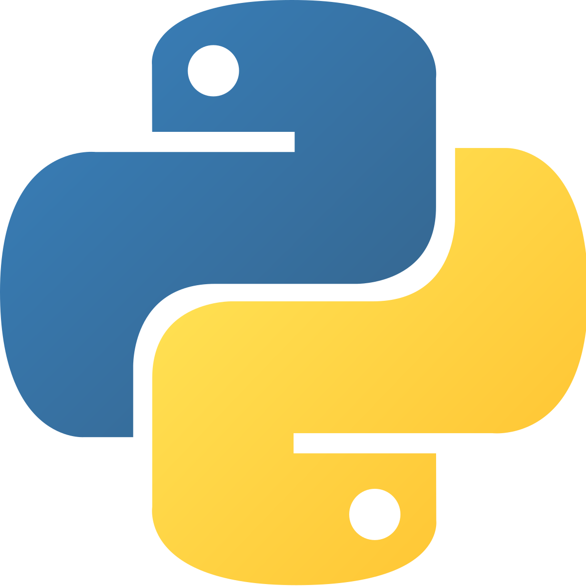
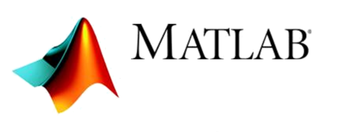
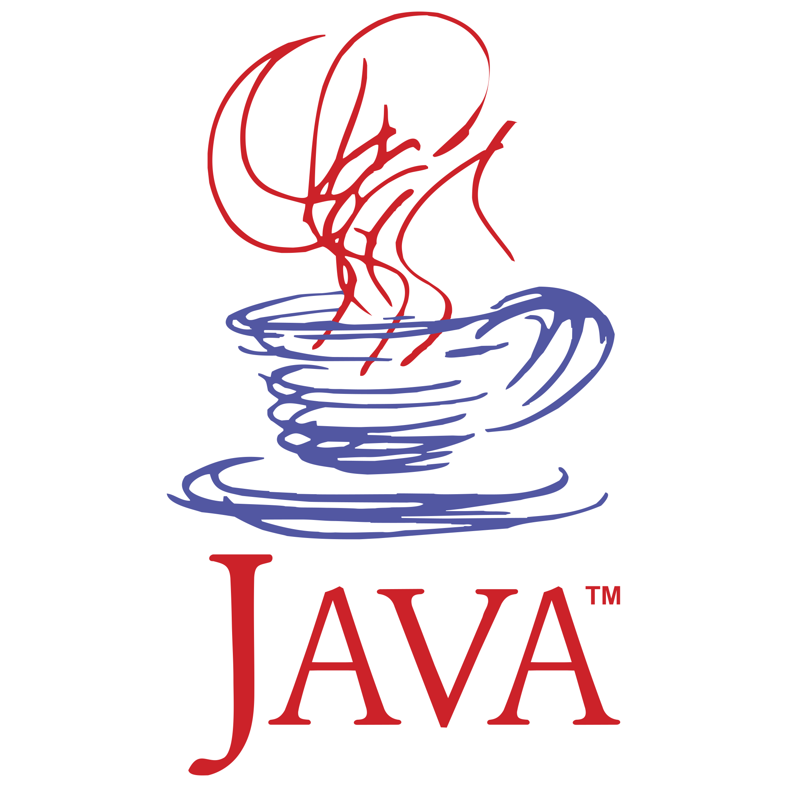
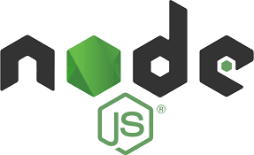
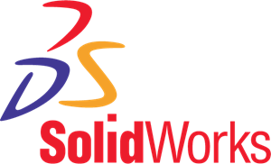
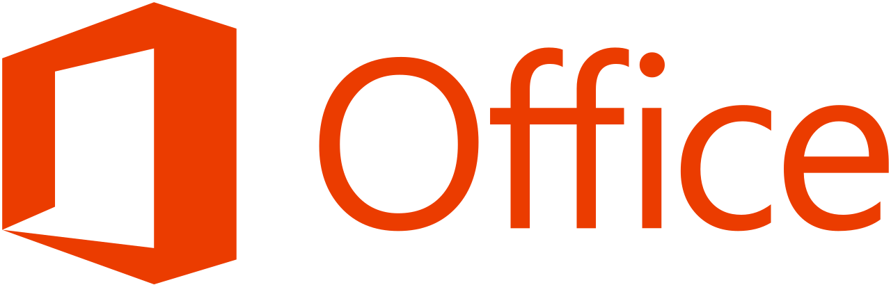

### Iago Henrique Moreira (morallito) 📃🚀 

#### Profile: 

Mechatronics Engineer, with exchange experiences in Portugal, I am a
multidisciplinary professional, accustomed to working with projects of open scope and that
require ease of exchange between areas of knowledge. I have ease in dealing with people
various teams. Knowledgeable of agile methodologies and practices, I can work and lead teams
that use such methodologies. Among my main characteristics, I like to highlight the ease of
teamwork, proactivity and my taste for solving problems in areas and areas of knowledge that
are not part of my training.

### 🔭 

- Currently working as a DevOps engineer in a Data science company.  

### 🧠 

- Currently learning terraform, AWS, Azure, Hashicorp Packer and K8s.

### 💻

- Currently working in a terraform CLI to refresh my python skills. 

### Skills 

| Programming languages | Softwares    | 
|:-----------------:    |:------------:|
|       |   | 
|    |   | 
|      |   |  
|      |   | 
|                |   | *
|                                                                                            |   

## Personal intersts: 
* Mountain Bike  🚲
* Formula 1 🚥
* Nature Photograpy 📷
* Dogs 🐕🐩🐾
* Space Exploration, Astronomy and Science 
👾🚀🔭📘📐✏️📏🔬
* Pride 🌈

<h2>Connect with me!</h2>
 
 
   

## My most used languages in github:

 
 
 
